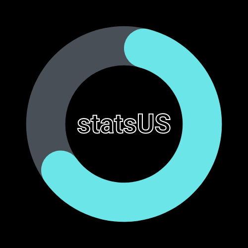

# description
statsUS is a free service to provide statistics for [a mock government](https://discord.gg/NnbQbBTpeJ). its analysis is powered by regression-js and Chart.js.

# datasets
all data used is located in `datasets`. the index of all files is at `datasets/index.json`. message counts are gross and the federal reserve is counted for the economy. day-by-day provides first: saturday last week, sunday, monday, tuesday, wednesday, thursday, and friday.